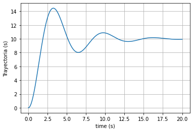
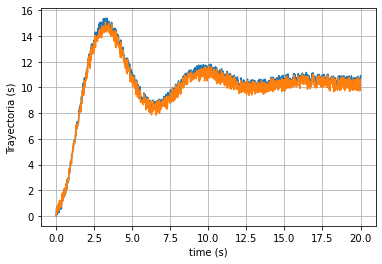
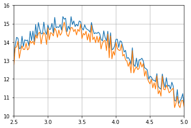
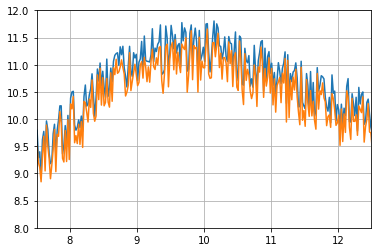

# Ejemplo de Kalman en Python. 

Se utiliza el modelo un sistema Masa-Resorte-Amortuguador y se observa la trayectoria 

Trayectoria del móvil

Trayectoria obtenida con Filtro de Kalman.

Viendo más de cerca:

