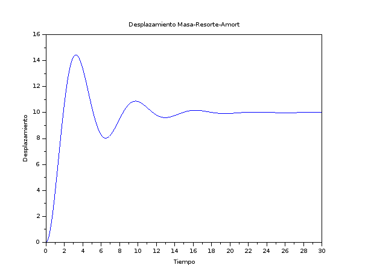

# Ejemplo de Kalman en Scilab. 

Se utiliza el modelo un sistema Masa-Resorte-Amortuguador y se observa la trayectoria 

Trayectoria del móvil

Trayectoria obtenida con Filtro de Kalman.

En rojo la trayectoria del móvil con ruido.
En negro la trayectoria obtenida mediante Kalman

