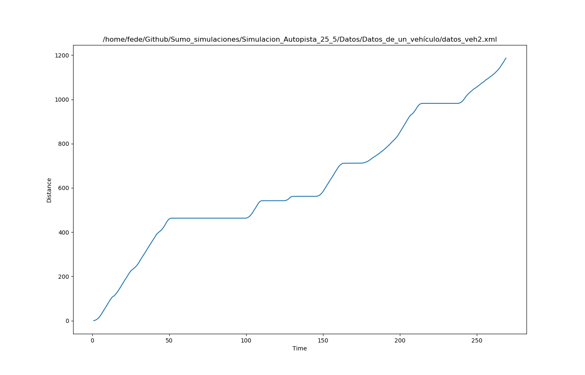
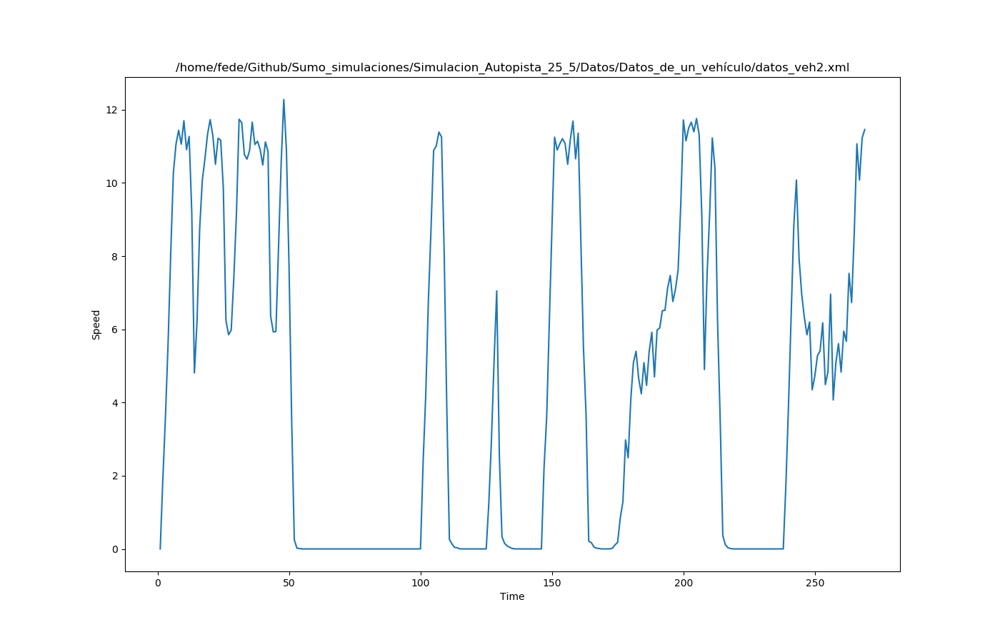
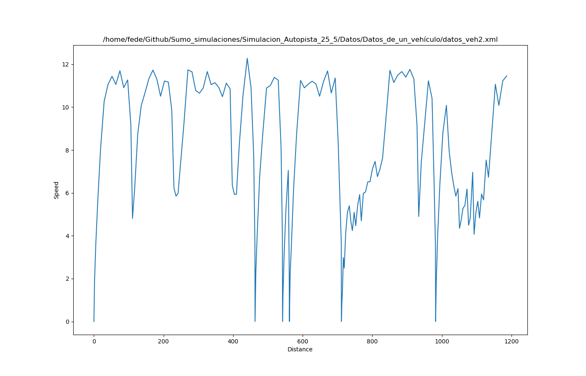

## Gráficos

Sumo permite realizar distintos tipos de fráficos. Estos se pueden ver en:

[https://sumo.dlr.de/docs/Tools/Visualization.html#plot_trajectories.py](https://sumo.dlr.de/docs/Tools/Visualization.html#plot_trajectories.py)

Para realizar los gráficos se utiliza el siguiente módulo de python, el cual se encuentra en la carpeta de sumo

`plot_trajectories.py`

Para realizar el gráfico se necesita el archivo .xml con los datos. Por ejemplo, si se quisiera graficar la distancia en función del tiempo para el veh2, se puede utilizar el siguiente comando:

`python plot_trajectories.py datos_veh2.xml -t td -o plot.png -s`

Tener en cuenta que si el archivo se encuentra en otra carpeta, donde dice datos_veh2.xml, se puede incluir la ruta del archivo.

A continuación se observa el gráfico de __tiempo vs distancia__ para el vehículo 2 (veh2)

Si se quisiera grafica la __tiempo vs velocidad__ para el vehículo 2 (veh2), hay que modificar la opción __-t__, de __td__ a __ts__

`python plot_trajectories.py datos_veh2.xml -t ts -o plot.png -s`

Si se quisiera grafica la __distancia vs velocidad__ para el vehículo 2 (veh2), hay que modificar la opción __-t__, de __td__ a __ds__

`python plot_trajectories.py datos_veh2.xml -t ds -o plot.png -s`

