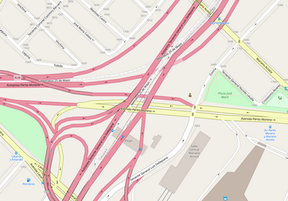
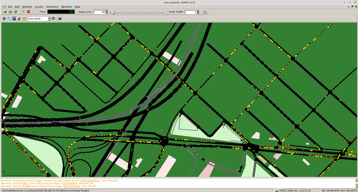

## Simulación de Ciudad

En este caso se construye la División de Autopistas 25 de Mayo, Perito Moreno y Dellepaine, con el objetivo de analizar el tránsito.

## Cosas a tener en cuenta.

Para simular la ciudad, se puede usar el siguiente módulo de Python osmWebWizard.py, el cual se puede correr como:

__python osmWebWizard.py__

Este módulo se encuentra en la carpeta (a la fecha 08/8/2020 esta es la última versión): 

__sumo-all-1.6.0/tools/osmWebWizard.py__

## Ciudad a simular.

División de Autopistas 25 de Mayo, Perito Moreno y Dellepaine. Coordenadas: -34.649850 -58.465091
(estas coordenadas se pueden ingresar en osmWebWizard.py)

Luego se puede seleccionar la cantidad de mòviles, buses, motos, etc. En este caso se seleccionan 230 móviles, 30 camiones, 25 colectivos, 6 motos y 6 bicicletas. 

Luego, se genera el escenario y se pasa a SUMO, donde se puede correr la simulación.

Los bloques amarillos resulta ser lo móviles, colectivos, etc. 

## Datos de salida.

Sumo tiene la opción de mostrar varias salidas:

[https://sumo.dlr.de/docs/Simulation/Output.html](https://sumo.dlr.de/docs/Simulation/Output.html)

Una de ellas que resulta importante para determinar posición, velocidad e inclinación, es FCDOutput:

[https://sumo.dlr.de/docs/Simulation/Output/FCDOutput.html](https://sumo.dlr.de/docs/Simulation/Output/FCDOutput.html)

FCD (floating car data) exporta la información de cada vehículo que se encuentra en la simulación del tráfico. Para su utilización se puede usar el siguiente comando:

 `--fcd-output <FILE>`

Para la simulación que se trata, se utiliza de la siguiente forma:

`sumo -c osm.sumocfg --fcd-output datos_vehic.xml`

Siendo: 

__osm.sumocfg:__ El archivo que contiene la simulación del tráfico

__datos_vehic.xml:__ Archivo que contiene los datos de todos los vehículos para cada paso de simulación. Debe cortarse en algún momento durante su ejecución dado que de lo contrario puede generar un peso importante.

A continuación se observa una muestra de las primeras corridas:

`<timestep time="0.00">

        <vehicle id="bike0" x="506.25" y="897.53" angle="193.63" type="bike_bicycle" speed="0.00" pos="1.70" lane="40336330#0_0" slope="0.00"/>
        <vehicle id="truck0" x="1924.82" y="972.14" angle="276.23" type="truck_truck" speed="16.16" pos="7.20" lane="462876181#0_0" slope="0.00"/>

</timestep>

     <timestep time="1.00">

        <vehicle id="bike0" x="506.10" y="896.91" angle="193.63" type="bike_bicycle" speed="0.64" pos="2.34" lane="40336330#0_0" slope="0.00"/>
        <vehicle id="bus0" x="1919.95" y="972.67" angle="276.23" type="bus_bus" speed="12.24" pos="12.10" lane="462876181#0_0" slope="0.00"/>
        <vehicle id="truck0" x="1909.05" y="973.86" angle="276.23" type="truck_truck" speed="15.87" pos="23.07" lane="462876181#0_0" slope="0.00"/>
        <vehicle id="veh2" x="541.51" y="1022.49" angle="195.16" type="veh_passenger" speed="0.00" pos="5.10" lane="40336328#1_0" slope="0.00"/>

</timestep>
 
     <timestep time="2.00">
    
        <vehicle id="bike0" x="505.81" y="895.70" angle="193.63" type="bike_bicycle" speed="1.25" pos="3.58" lane="40336330#0_0" slope="0.00"/>
        <vehicle id="bus0" x="1907.90" y="973.99" angle="276.23" type="bus_bus" speed="12.12" pos="24.22" lane="462876181#0_0" slope="0.00"/>
        <vehicle id="moto0" x="1929.69" y="971.61" angle="276.23" type="moto_motorcycle" speed="9.54" pos="2.30" lane="462876181#0_0" slope="0.00"/>
        <vehicle id="truck0" x="1893.37" y="975.58" angle="276.23" type="truck_truck" speed="15.77" pos="38.84" lane="462876181#0_0" slope="0.00"/>
        <vehicle id="veh2" x="541.00" y="1020.64" angle="195.16" type="veh_passenger" speed="1.92" pos="7.02" lane="40336328#1_0" slope="0.00"/>
        <vehicle id="veh3" x="1279.13" y="1187.87" angle="312.51" type="veh_passenger" speed="0.00" pos="5.10" lane="-21619598#1_0" slope="0.00"/>
        <vehicle id="veh5" x="1142.07" y="1308.91" angle="132.33" type="veh_passenger" speed="10.42" pos="5.10" lane="21619598#0_0" slope="0.00"/>
    
    </timestep>`

## Conversión a .csv

Los datos de salida que otorga SUMO se encuentran en formato XML, sin embargo, se puede convertir a CSV mediante:

__python xml2csv.py input.xml__

    
