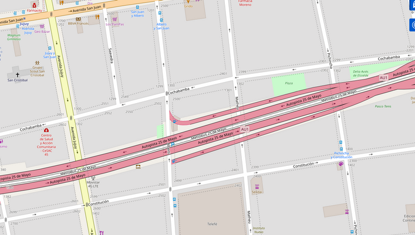
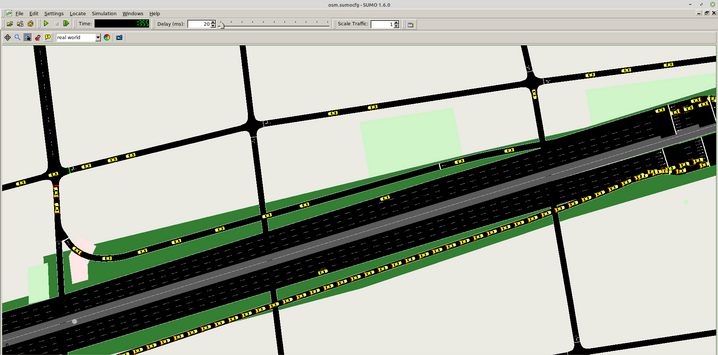

## Simulación de Autopista con peajes

## Mapa de subidas y bajadas de la Autopista Perito Moreno

Fuente: [https://www.ausa.com.ar/documentos/AUSA-Mapa-Autopistas.pdf](https://www.ausa.com.ar/documentos/AUSA-Mapa-Autopistas.pdf)

## Simulación son SUMO

En base a la imagen anterior, se simula la Autopista 25 de Mayo que se une con la Autopista Perito Moreno, donde se ubica el Peaje Perito Moreno. De esta forma, se podrá estudiar cuántos móviles llegan al Peaje Perito Moreno (o bajan antes en la Au. 25 de Mayo). Las bajadas, según la imagen anterior, ocurren en: __Alberti__, __Av. Entre Ríos__, __Av. 9 de Julio__. Se puede tomar por ejemplo, la bajda en __Alberti__ dado que es la última antes de que el/los móvil/es sigan hacia el Peajo de la Au. Perito Moreno.

A continuación se observa la coordenada: `-34.625216 -58.399788` con __osmWebWizard__, donde se ve la bajada de la Au. 25 de Mayo sobre Alberti.

__Simulando con SUMO__

En la imagen anterior se puede observar cómo los móviles toman direcciones distintas ante la bajada de Alberti. Uno de ellos sigue por la Au. 25 de Mayo y el otro toma la bajada.
En base a esto, se propone seguir la dirección del móvil que continúa por la Au. 25 de Mayo para saber si llega al Peaje Perito Moreno.

