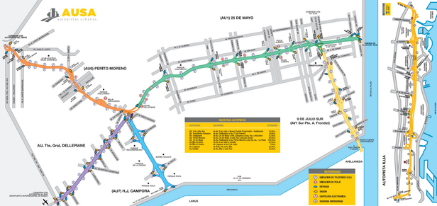

## Simulación de Autopista con peajes

## Mapa de subidas y bajadas de la Autopista Perito Moreno

Fuente: [https://www.ausa.com.ar/documentos/AUSA-Mapa-Autopistas.pdf](https://www.ausa.com.ar/documentos/AUSA-Mapa-Autopistas.pdf)

## Análisis de móviles

En base a la imagen anterior, se propone simular la cantidad de móviles que pasan por el Peaje Perito Moreno  __(PPM)__. Para esto, se toma la Autopista 25 de Mayo la cual se une con la Autopista Perito Moreno, ya que sobre esta última se ubica el Peaje Perito Moreno. Para determinar cuántos móviles pasan por el __PPM__, hay que tener en cuenta que la Au.25 de Mayo se divide en Au. Perito Moreno y en Au. Dellepiane, luego de Plaza de los Virreyes. Esto se muestra a continuación (imagen obtenida de Google Maps):

La imagen anterior se puede obtener con la coordenada: `-34.642933, -58.461665` 

__Simulando con SUMO__

Se introducen las coordenadas en osmWebWizard y se obtiene el mapa para la simulación. A continuación se muestra la simulación en SUMO donde se ve cómo los autos que vienen por la Au.25 de Mayo se dividen por la Au.Perito Moreno y por la Au.Dellepiane. Para ver las trayectorias de cada móvil, se puede hacer click derecho sobre el móvil que se desea ver y agregar "mostrar ruta" (Show Current Route). En color amarrillo se ve la trayectoria:

__Móvil hacia Au.Perito Moreno__  id del móvil:__veh1769__

El mismo móvil pasa por el peaje __PPM__

__Móvil hacia Au.Dellepiane__  id del móvil:__veh3273__

