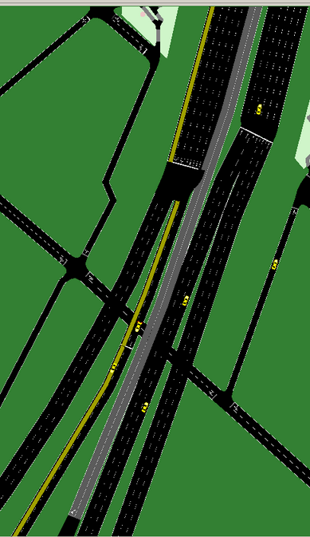
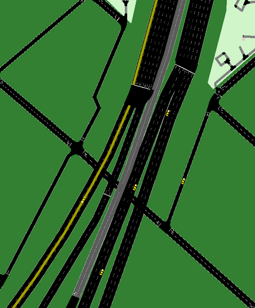

## Lectura de los archivos csv

__datos_vehic.csv:__ archivo con datos de la simulación

__PPM_00.csv:__ archivo con datos de autos que van por el carril de la iziquierda de la Au.25 de Mayo y siguen por el carril de la izquierda de la Perito Moreno

__PPM_03.csv:__ archivo con datos de autos que van por el carril del medio de la Au.25 de Mayo y siguen por el carril de la izquierda de la Perito Moreno

__Delle_00.csv:__ archivo con datos de autos que van por el carril de la iziquierda de la Au.25 de Mayo y siguen por el carril de la izquierda de la Dellepiane

__Delle_30.csv:__ archivo con datos de autos que van por el carril del medio de la Au.25 de Mayo y siguen por el carril de la izquierda de la Dellepiane

A continuación se muestran las imágenes para entender cuáles son los carriles mencionads

