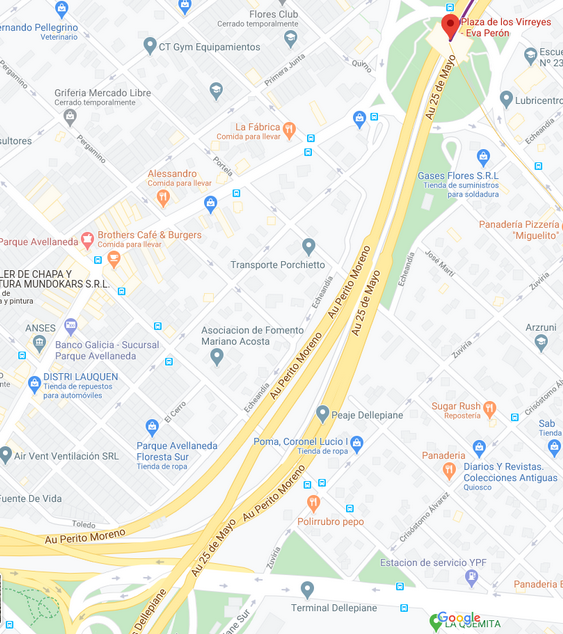

## Simulación Plaza de los Virreyes

## Mapa de subidas y bajadas de la Autopista Perito Moreno

## Análisis de móviles

Se propone simular la cantidad de móviles que salen de Plaza de Virreyes para estudiar a cuándo y a qué velocidad se dividen los autos que van para la Au.Dellepiane y los que van para el Peaje Perito Moreno.

Los __ids__ de las Autopistas a analizar son:

La que sale de plaza de los Virreyes, que tiene seis carriles:
__id: 325213134_0, 325213134_1, 325213134_2, 325213134_3, 325213134_4, 325213134_5, 325213134_2__ (izqiuerda a derecha)

La que va hacia PM, que tiene tres carriles:

__id:18908030_0, 18908030_1, 18908030_2__

La que va hacia la Dellepiane, que tiene dos carriles:

__id:39910457_0, 39910457_1__

Es posible que algunos de estos __ids__ cambie en el .csv en el último dígito, pero se trata de la misma autopista. El archivo .csv se encuentra en la carpeta __Datos__

