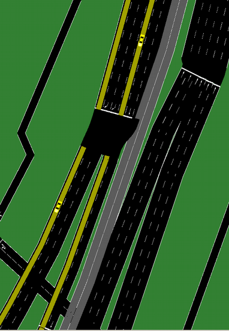
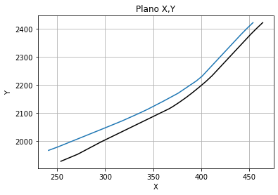
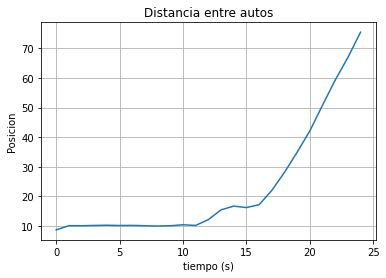
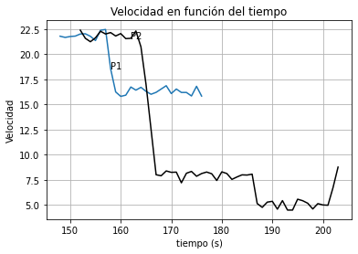
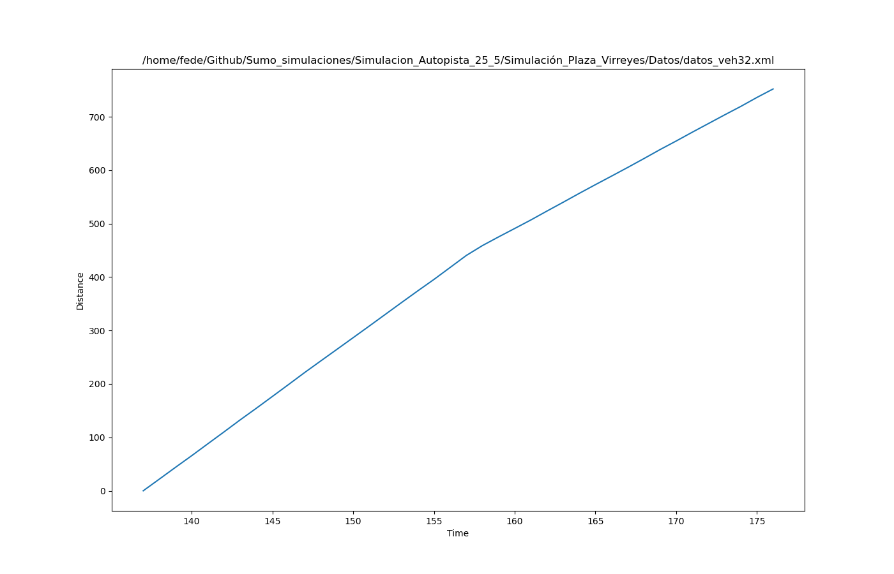

## Trayectoria de autos

Se proponen las siguientes trayectorias de móviles:

Dos autos: uno que viene por el __carril 0__ (izquierda) y otro por el __carril 3__ de la Au.25 de Mayo. El que viene por el __carril 0__ sigue por la Au.PM y el que viene por el __carril 3__ sigue por la Dellepiane.

Para esta simulación se usan los autos: 

a) __veh32__ del archivo __PPM_00.csv__, el cual viaja por el __carril 0__ de la Au.25 de Mayo y sigue por la PM.

b) __veh33__ del archivo __Delle_30.csv__, el cual viaja por el __carril 3__ de la Au.25 de Mayo y sigue por la Dellepiane.

En las siguiente imagen se observa la trayectoria del veh32 sobre las autopistas

## Gráficos de trayectorias:

Graficando ambos vehículos en el plano (x,y), quedan:

En color __azul__ se representa al __veh32__

En color __negro__ se representa al __veh33__

En el gráfico anterior se puede observar de derecha a izquierda. De esta forma, se puede ver que inicialmente los móviles mantienen una distancia entre ellos, casi constante. Luego de pasar por el peaje __(puntos P1 y P2)__, el __veh32 (color azul)__ sigue la trayectoria por la Au. Perito Moreno y el __veh33 (color negro)__ comienza a distanciarse, dado que toma la Au. Dellepiane.

## Distancia entre autos

## Gráfico de velocidades:

Graficando a cada uno por separado pero tomando la distancia en función del tiempo:

__veh32__

Graficando a cada uno por separado:

__veh33__

