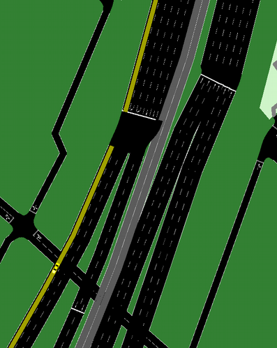

## Trayectoria de autos

Se proponen las siguientes trayectorias de móviles:

Dos autos: uno que viene por el __carril 0__ (izquierda) y otro por el __carril 3__ de la Au.25 de Mayo. El que viene por el __carril 0__ sigue por la Au.PM y el que viene por el __carril 3__ sigue por la Dellepiane.

Para esta simulación se usan los autos: 

a) __veh32__ del archivo __PPM_00.csv__, el cual viaja por el __carril 0__ de la Au.25 de Mayo y sigue por la PM.

b) __veh33__ del archivo __Delle_30.csv__, el cual viaja por el __carril 3__ de la Au.25 de Mayo y sigue por la Dellepiane.

En las siguientes imágenes se observan sus trayectorias sobre las autopistas

Los __ids__ de las Autopistas a analizar son:

La que sale de plaza de los Virreyes, que tiene seis carriles:
__id: 325213134_0, 325213134_3__ (izqiuerda a derecha)

La que va hacia PM, que tiene tres carriles:

__id:18908030_0__

La que va hacia la Dellepiane, que tiene dos carriles:

__id:39910457_0__

## Gráficos de trayectorias:

En base a esto se genera dos archivos, uno .xml y otro .csv, los cuales contienen las trayectorias de cada vehículo.

Se genera el archivo __datos_veh32.xml__ a partir del siguiente comando:

`sumo -c osm.sumocfg --fcd-output datos_veh32.xml --device.fcd.explicit veh32`

Luego se convierte a __.csv__ mediante:

`python xml2csv.py datos_veh32.xml`

Lo mismo se repite para el __veh33__

Con estos archivos se puede entonces graficar distancia vs tiempo mediante:

`python plot_trajectories.py datos_veh32.xml -t td -o veh32.png -s`

Se repite lo mismo para el veh33:

`python plot_trajectories.py datos_veh33.xml -t td -o veh33.png -s`

