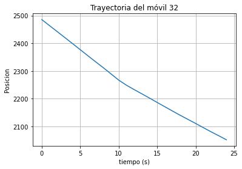
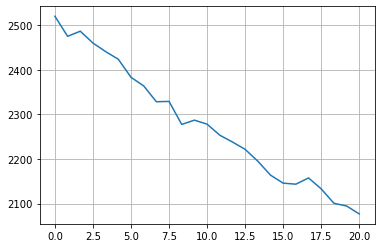
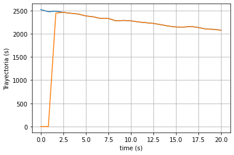
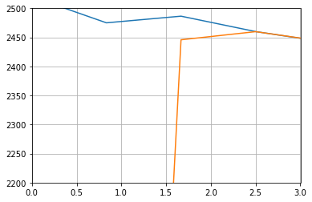
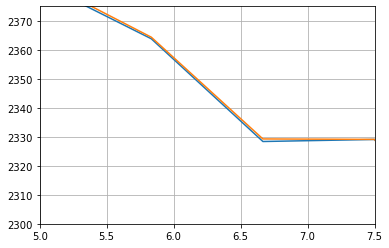

## Trayectoria de autos

Se proponen las siguientes trayectorias de móviles:

Dos autos: uno que viene por el __carril 0__ (izquierda) y otro por el __carril 3__ de la Au.25 de Mayo. El que viene por el __carril 0__ sigue por la Au.PM y el que viene por el __carril 3__ sigue por la Dellepiane.

Para esta simulación se usan los autos: 

a) __veh32__ del archivo __PPM_00.csv__, el cual viaja por el __carril 0__ de la Au.25 de Mayo y sigue por la PM.

b) __veh33__ del archivo __Delle_30.csv__, el cual viaja por el __carril 3__ de la Au.25 de Mayo y sigue por la Dellepiane.

En las siguiente imagen se observa la trayectoria del veh32 sobre las autopistas

## Gráficos de trayectorias:

Graficando ambos vehículos en el plano (x,y), quedan:

En color __azul__ se representa al __veh32__

En color __negro__ se representa al __veh33__

En el gráfico anterior se puede observar de derecha a izquierda. De esta forma, se puede ver que inicialmente los móviles mantienen una distancia entre ellos, casi constante. Luego de pasar por el peaje __(puntos P1 y P2)__, el __veh32 (color azul)__ sigue la trayectoria por la Au. Perito Moreno y el __veh33 (color negro)__ comienza a distanciarse, dado que toma la Au. Dellepiane.

## Distancia entre autos

En el punto __Peaje__, es donde comienzan a distanciarse los vehículos. Luego a partir del puno __P__ el Veh33 sigue por la misma autopista pero aumenta su distancia con respecto a Veh32.

## Gráfico de velocidades:

## Estimación de Trayectorias

Teniendo en cuenta la trayectoria de cada móvil, a continuación se muestra una estimación usando Filtro de Kalman. Para esto se utiliza al móvil __veh32__ tomando la distancia en función del tiempo. En base a esto, se utilizan las siguientes ecuaciones:

pk = pk-1 + &Delta;t vk-1 

vk-1 =                        vk-1 

$\left[\begin{array}{ccc}
10 & 0\\
0 & 5
\end{array}\right]$

Esto queda:

La trayectoria anterior no contempla el "ruido" que pudiera tener. A continuación se muestra la misma trayectoria con "ruido"

Mediante Kalman, se estima la trayectoria del móvil con "ruido"

En base a esto, se muestran dos imágenes. La primera muestra cómo se adapta el Filtro de Kalman desde una condición inicial nula y la segunda muestra un zoom de un tramo de la trayectoria

